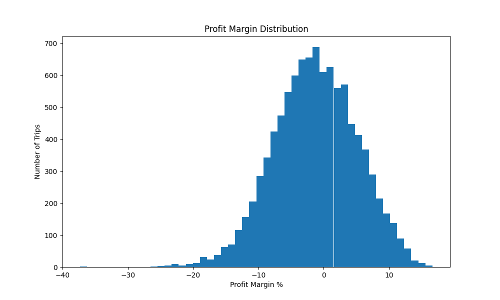
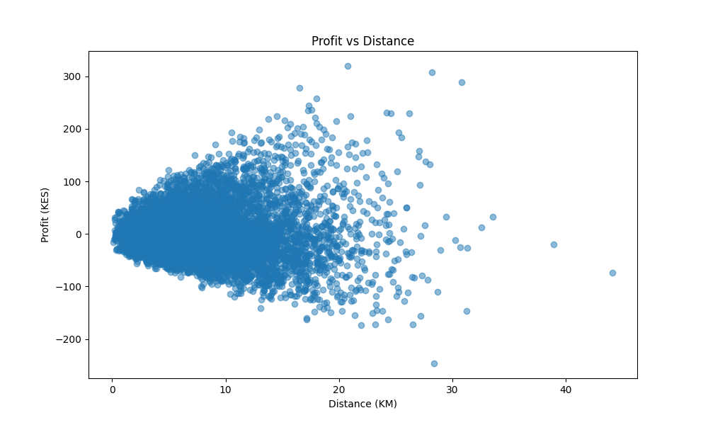
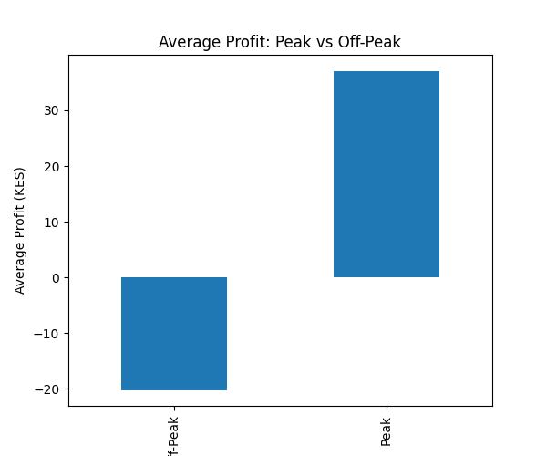
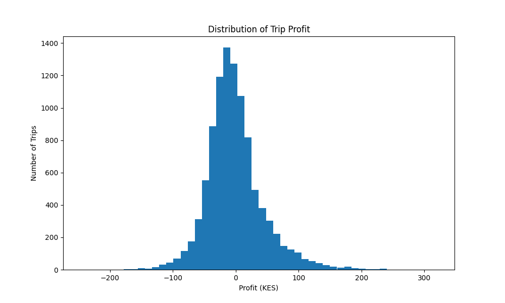

# Ride Pricing and Unit Economics Analysis
Investigating the unit economics why 57.6% of trips lose money and what pricing architecture can fix it

## The Business Problem
Ride hailing platforms are one of the most scrutinised business models in modern commerce. 
In context — Uber lost over $20bn before reaching profitability and unit economics remain fragile across emerging markets. The platforms operate within highly compressed margins where profitability is influenced by balancing dynamic pricing, operational costs, traffic exposure and driver compensation structures.
How can pricing and unit economics be optimized to improve ride profitability?

This investigation examines a simulation of 10,000+ trips from a 
KES denominated ride hailing platform to answer one central question:

**What operational and pricing factors drive profitability, and which pricing strategies best reduce unprofitable trips?**

The findings challenge two common assumptions:
- That short trips are inherently unprofitable
- That increasing trip volume improves Margins

Both are false. The data points to a single structural cause — and a narrow but highly actionable fix.

## Assumptions & Analytical Boundaries

> The analysis was conducted using simulated ride level operational data designed to approximate profitability behavior within a ride hailing platform environment.
> To evaluate trip level unit economics consistently across ride scenarios, several modeling, pricing, and operational assumptions were applied throughout the analysis.

### 1. Modelling Assumptions
- Trip-level profitability was evaluated independently for each ride without broader marketplace dynamics such as fleet allocation
- Simulated ride patterns were assumed to reasonably approximate real world ride hailing behavior
- Profitability analysis focused primarily on variable ride level economics and excluded broader corporate overhead costs

### 2. Pricing Assumptions
- Surge multipliers were assumed to reflect elevated demand and congestion conditions.
- Moderate fare adjustments were assumed not to materially reduce short-term ride demand.
- Dynamic pricing was assumed to partially offset operational inefficiencies during peak periods.

### 3. Operational Assumptions
- Fuel costs were assumed to scale proportionally with trip distance and duration.
- Driver payouts were modeled as the primary operational cost component.
- Congestion-heavy trips were assumed to increase operational exposure and reduce ride efficiency.

## Project Objectives
The objective of this analysis was to identify:
1. Which trips are most profitable
2. Which operational factors drive margin compression
3. Which pricing strategies reduce unprofitable rides most effectively

## The Approach
- Analyzing trip level profitability
- Evaluating unit economics across ride scenarios
- Identify key drivers of margin performance
- Exploring the relationship between pricing and operational efficiency
- Simulating pricing optimization strategies
- Reduce the proportion of unprofitable trips

---

# Tools Used


---

# Project Workflow
Data Simulation → Exploratory Analysis → Profitability Analysis → Scenario Simulation → Business Recommendations

## Analytical Framework
 # The Data
|---|---|
| Source | Simulated trip dataset |
| Volume | 10,000 trips |
| Currency | Kenyan Shilling (KES) |
| Time range | Jan – Apr 2025 |
| Granularity | Individual trip level |

| Overall Metric | Business Purpose | Why it matters
|---|---|---|
| Distance (km) | Measures trip length and operational exposure | Distance affects fuel consumption, driver payouts, and overall cost efficiency across rides. |
| Duration (minutes) | Evaluates time efficiency of trips | Longer durations reduce driver utilization efficiency and may compress profit margins during congestion-heavy periods. |
| Surge Multiplier | Captures dynamic pricing adjustments | Surge pricing helps compensate for elevated demand, traffic exposure, and driver scarcity during peak periods. |
| Driver Payout | Represents primary operational cost component | Driver compensation significantly impacts platform-level margins since payouts consume a large share of ride revenue. |
| Fuel Cost | Measures variable operating expenses | Rising fuel costs disproportionately affect long-duration and congestion-heavy rides, reducing profitability efficiency. |
| Revenue | Captures total ride-level earnings | Revenue alone does not determine profitability, but it establishes the baseline for evaluating margin performance. |
| Profit | Measures trip-level earnings after costs | Profit identifies which ride scenarios contribute positively or negatively to platform sustainability. |
| Profit Margin % | Evaluates revenue efficiency | Margin analysis reveals how effectively ride revenue converts into profit under varying operational conditions. |
| Profit per Minute | Measures operational efficiency over time | Higher profit-per-minute trips improve driver utilization and overall marketplace efficiency. |
| Peak vs Off-Peak Classification | Segments demand conditions | Peak periods introduce higher demand and pricing opportunities but also increased operational exposure. |

 # Core Unit Economics Metrics
The analysis was centered around a set of operational and profitability metrics used to evaluate the efficiency and sustainability of ride-level economics within the simulated platform.

| Core Metric | Definition | Why It Matters |
|---|---|---|
| Contribution margin | Profit ÷ Fare | Normalises across fare levels |
| Revenue per km | Fare ÷ Distance | Measures distance monetisation |
| Driver cost ratio | Driver payout ÷ Fare | Most sensitive cost lever |
| Profit per minute | Profit ÷ Duration | Captures operational efficiency |
| Surge capture rate | Surged trips ÷ Total trips | Pricing architecture health |
| Profit per Trip | Measures trip-level profitability after operational costs | Determines whether individual rides contribute positively or negatively to platform sustainability and overall profitability. |
| Profit Margin % | Evaluates how efficiently ride revenue converts into profit | Reveals pricing efficiency and highlights scenarios where operational costs compress margins despite strong revenue generation. |
| Profit per Minute | Measures operational profitability relative to trip duration | Higher profit-per-minute rides improve driver utilization, operational efficiency, and marketplace productivity. |
| Revenue per Kilometer | Assesses pricing efficiency relative to trip distance | Helps identify whether fare structures sufficiently compensate for operational exposure and trip-related costs. |
| Cost per Kilometer | Measures operational cost exposure across ride distance | Identifies ride categories where operational costs escalate disproportionately relative to pricing efficiency. |
| Driver Payout Ratio | Evaluates the proportion of revenue allocated to driver compensation | Driver payouts represent a major operational expense and significantly influence overall platform margin sustainability. |
| Unprofitable Trip Rate | Measures the percentage of rides generating negative profit | Highlights the extent of margin leakage and serves as a key indicator of pricing and operational inefficiencies. |
| Surge-Adjusted Profitability | Evaluates profitability under dynamic pricing conditions | Determines whether surge pricing adequately compensates for congestion, elevated demand, and operational strain. |
| Profitability by Trip Segment | Compares profitability across short, medium, and long-distance rides | Helps identify which ride categories contribute most effectively to sustainable platform economics. |
| Peak vs Off-Peak Margin Performance | Measures profitability differences across demand periods | Reveals how congestion and dynamic pricing interact to influence operational efficiency and margin behavior. |
| Fuel Cost Exposure | Measures the impact of fuel consumption on ride profitability | Fuel-related operational costs can significantly compress margins during long-duration and congestion-heavy trips. |
| Duration Efficiency | Evaluates how trip duration affects profitability outcomes | Longer trip durations may reduce ride turnover efficiency and increase operational exposure without proportionate revenue growth. |
| Surge Efficiency Ratio | Measures profitability improvement relative to surge multiplier increases | Helps assess whether dynamic pricing mechanisms are sufficiently optimizing revenue during peak-demand conditions. |
| Margin Compression Exposure | Identifies ride scenarios where costs grow faster than revenue | Highlights operational conditions that weaken profitability efficiency despite increasing ride revenue. |

# Key Business Insight
Contrary to common assumptions, the analysis suggested that longer rides were not consistently the most profitable on a time adjusted basis. Several short rides generated significantly higher profit per minute, highlighting the importance of pricing efficiency and operational turnover in ride hailing unit economics.

## Highlights
- Analyzed 10,000+ ride-level records
- Simulated pricing optimization strategies
- Reduced unprofitable trip scenarios by up to 20%
- Evaluated peak-hour and short-trip margin performance

# Sample Visualizations

## Profit Margin Distribution



## Profit vs Distance



## Peak vs Offpeak Profit



---

## Project Overview

This project analyzes ride level pricing within a simulated Nairobi ride hailing environment. The objective was to identify profitability drivers, evaluate operational inefficiencies, and simulate pricing strategies that could improve margins.

The analysis focuses on how trip distance, trip duration, surge pricing, driver payouts and fuel costs influence profitability across thousands of rides.

---
# Objectives

- Analyze trip-level profitability
- Identify loss-making ride segments
- Compare peak vs off-peak performance
- Evaluate pricing inefficiencies
- Simulate pricing adjustment strategies
- Assess operational margin performance

---


## Project Workflow

Data Simulation → Exploratory Analysis → Visualization → Pricing Simulation → Business Recommendations

# Key Analysis Performed

## 1. Exploratory Data Analysis
- Profitability overview
- Margin distribution analysis
- Peak vs off-peak comparison
- Distance-based profitability analysis

## 2. Visualization Analysis
Visualizations were developed to evaluate:
- Profit distributions
- Margin variability
- Profitability by trip distance
- Peak-hour performance

## 3. Pricing Simulation
Several pricing scenarios were tested:
- Increasing short-trip fares
- Adjusting peak-hour pricing

The simulations were used to evaluate:
- Average profit improvement
- Reduction in unprofitable trips
- Margin performance changes

---
# Findings

- A significant share of trips generated low or negative margins
- Short-distance rides contributed disproportionately to margin leakage
- Peak-hour trips generated higher revenue but also higher operational costs
- Pricing adjustments on short trips improved average profitability by 12–18%

---

# Business Recommendations

- Introduce minimum fare thresholds for short trips
- Optimize surge pricing during congestion-heavy periods
- Evaluate operational efficiency during peak traffic hours
- Balance platform profitability against driver incentive structures
- Selected simulations reduced loss-making trips by approximately 20%

---


# Project Structure

```text
ride-pricing-optimization/
│
├── data/
├── scripts/
├── visuals/
├── notebooks/
└── README.md
```

---

# Exploratory Data Analysis
# Visualizations

## Peak vs Offpeak Profit


## Profit Distributuion
This visualization shows the distribution of ride level profitability across the simulated platform. While many rides generated positive profit, a noticeable portion clustered near breakeven levels, indicating potential margin vulnerability.


### Profit Margin Distribution
Profit margin provides a normalized profitability measure across trips of different sizes. The distribution highlights margin variability and identifies areas where pricing and cost structures may be insufficient.


### Profit vs Distance
Distance contributes to revenue generation but also increases operational exposure. This visualization tests whether longer rides consistently deliver stronger profitability outcomes.


### Profit per Minute vs Duration
Profit per minute was used as a measure of operational efficiency. The Analysis revealed that longer trips did not consistently generate higher profitability efficiency despite producing more total revenue. The highest profit-per-minute outcomes were concentrated among shorter duration rides, suggesting that operational efficiency and pricing structure play a greater role in profitability than trip duration alone.
This finding indicates that targeted pricing interventions may be more effective than uniform fare increases when improving platform profitability.


### Surge Multiplier vs Profit Margin
A strong positive relationship was observed between surge pricing and profitability. Trips operating under higher surge multipliers consistently achieved stronger margins, while the majority of severely unprofitable rides occurred under low-surge conditions.
The analysis suggests that dynamic pricing is an effective mechanism for mitigating margin leakage during periods of elevated demand. However, the persistence of some negative margin rides at higher surge levels indicates that pricing alone is insufficient and must be complemented by operational efficiency improvements.

**Key Insight:** Increasing surge multipliers from approximately 1.0x to 1.8x shifted average trip profitability from predominantly break even or negative margins toward consistently positive margin outcomes, demonstrating the importance of dynamic pricing in ride hailing unit economics.

### Profitability by Trip Segment
Trips were segmented into short (0–5 km), medium (5–15 km), and long-distance (15+ km) categories to evaluate margin performance across ride types. Contrary to the initial expectation that shorter trips may be more profitable due to faster turnover, the analysis showed that short distance rides generated the weakest average margins. Long distance trips produced the strongest average profitability outcomes, while short trips exhibited the greatest margin compression.

**Key Insight:** Many short trips are being priced too close to cost, causing margin leakage despite their operational efficiency.


This suggests that short-distance rides are particularly vulnerable to pricing inefficiencies and represent the largest opportunity for targeted pricing optimization.
---

# Future Improvements

- Incorporate real-world ride datasets
- Add geospatial route analysis
- Develop forecasting models for demand prediction
- Build interactive Power BI dashboards

---

# Author

Zack Theodore Osebe
